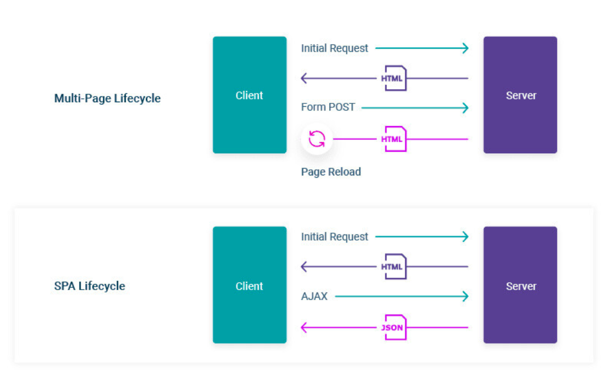
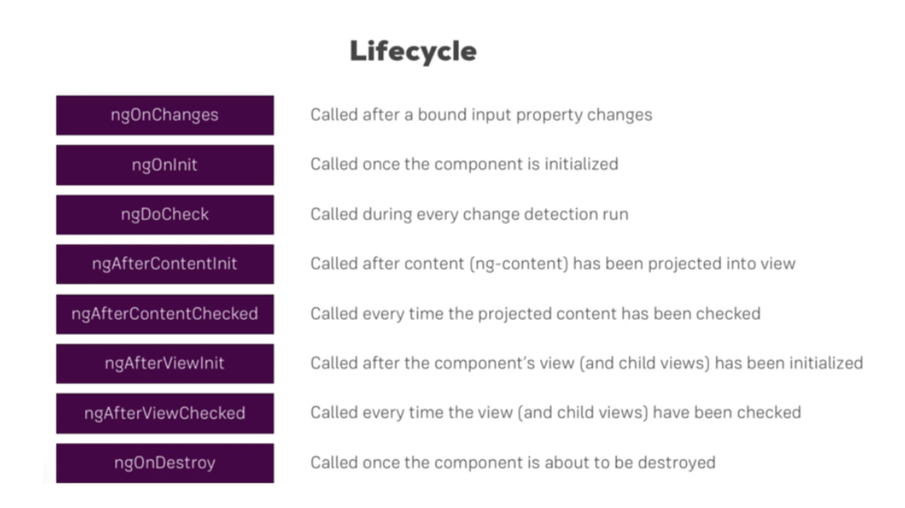

# AngularLifecycle

ngOnChanges():- ngOnChanges called before ngOnInit() and whenever one/more data-bound input properties change.
It means, whenever any input properties changed than the code under this function will be triggered.

ngOnChange(changes: SimpleChanges){
console.log(“ngOnChange running”);
console.log(changes);
}

ngOnInit():- ngOnInit is there to give us a signal that Angular has finished initializing the component and now we can perform our needed operations.
Therefore, I consider it as one of the important hooks from a list of Angular lifecycle hooks and very useful, as well.

ngOnInit(){
console.log(“ngOnInit running”);
}

ngDoCheck():- ngDoCheck is known as a detector because it’s called whenever any changes during the app execution happened.
Also, it detects the changes and angular doesn’t able to detect those explicit changes.
In addition, it’s called immediately after ngOnChange and ngOnInit.

ngDoCheck(){
console.log(“ngDoCheck running”);
}

ngAfterContentInit():- ngAfterContentInit, as the name suggested, responds when the angular app projects content into the component’s view and the view is ready.
It is called once after the first ngDoCheck().
It is also known as a component-only hook.

ngAfterContentInit(){
console.log(“ngAfterContentInit running”);
}

ngAfterContentChecked():- ngAfterContentChecked, as its name suggested respond after the app checks the content actually projected into the component.
It called after ngAfterContentInit and every subsequent check.

ngAfterContentChecked(){
console.log(“ngAfterContentChecked running”);
}

ngAfterViewInit():- ngAfterViewInit, responds after app initialized and all the views of component has been ready.
It called once after the first ngAfterContentChecked.

ngAfterViewInit(){
console.log(“ngAfterViewInit running”);
}

ngAfterViewChecked():- ngAfterViewChecked, responds after app checks all the parent and child views of components.
It called after the ngAfterViewInit and every subsequent call of ngAfterContentChecked

ngAfterViewChecked(){
console.log(“ngAfterViewChecked running”);
}

ngDestroy():- The ngDestory, as its name suggested, will use to do clean-up just before the angular app destroys everything.
Furthermore, it will detach the events, unsubscribe the Observables, etc to avoid any memory leaks.
It is called just before the angular app destroys everything like the directive and components.

ngDestroy(){
console.log(“ngDestroy running”);
}

This project was generated with [Angular CLI](https://github.com/angular/angular-cli) version 17.3.6.

## Development server

Run `ng serve` for a dev server. Navigate to `http://localhost:4200/`. The application will automatically reload if you change any of the source files.

## Code scaffolding

Run `ng generate component component-name` to generate a new component. You can also use `ng generate directive|pipe|service|class|guard|interface|enum|module`.

## Build

Run `ng build` to build the project. The build artifacts will be stored in the `dist/` directory.

## Running unit tests

Run `ng test` to execute the unit tests via [Karma](https://karma-runner.github.io).

## Running end-to-end tests

Run `ng e2e` to execute the end-to-end tests via a platform of your choice. To use this command, you need to first add a package that implements end-to-end testing capabilities.

## Further help

To get more help on the Angular CLI use `ng help` or go check out the [Angular CLI Overview and Command Reference](https://angular.io/cli) page.
